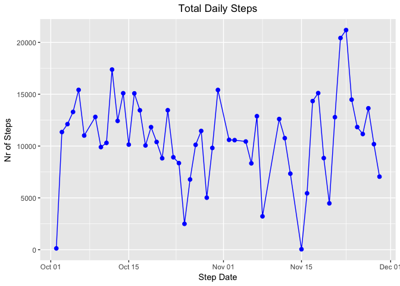
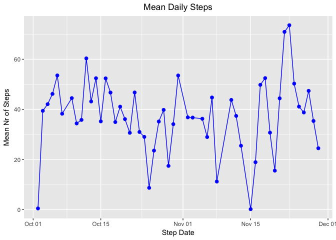
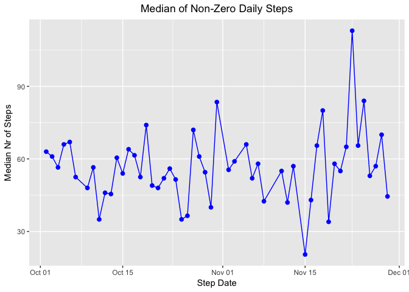
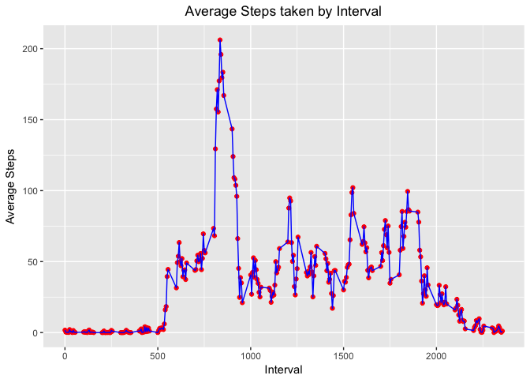
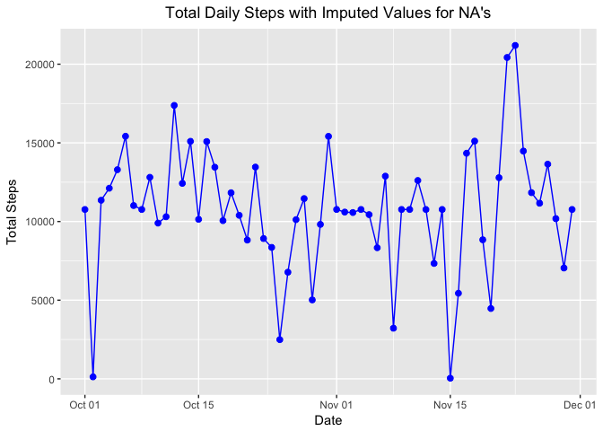
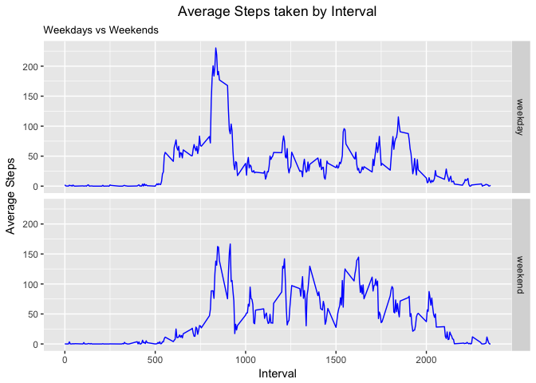

## Loading and preprocessing the data


```r
#
# start by ensuring necessary packages available
#

if (!"knitr" %in% installed.packages()) {
  install.packages("knitr")
}
library(knitr)
options(digits = 2)

if (!"dplyr" %in% installed.packages()) {
  install.packages("dplyr")
}
library(dplyr)
```

```
## 
## Attaching package: 'dplyr'
```

```
## The following objects are masked from 'package:stats':
## 
##     filter, lag
```

```
## The following objects are masked from 'package:base':
## 
##     intersect, setdiff, setequal, union
```

```r
if (!"lubridate" %in% installed.packages()) {
  install.packages("lubridate")
}
library(lubridate)
```

```
## 
## Attaching package: 'lubridate'
```

```
## The following object is masked from 'package:base':
## 
##     date
```

```r
if (!"ggplot2" %in% installed.packages()) {
  install.packages("ggplot2")
}
library(ggplot2)

if (!"xtable" %in% installed.packages()) {
  install.packages("xtable")
}
library(xtable)

#
# get local copy of zip file & rename/mutate field called date
# to eliminate worries re reserved words or data type
#

print("preparing input file ...")
```

```
## [1] "preparing input file ..."
```

```r
fileName <- "./activity.zip"
fileUrl = "https://github.com/rdpeng/RepData_PeerAssessment1/blob/master/activity.zip"
if(!file.exists(fileName)) {
    download.file(fileUrl, "./activity.zip", method = "curl")
}

unzfileName <- "./activity.csv"
if(!file.exists(unzfileName)) {
    unzip("./activity.zip", files = "activity.csv")
}

acts <- read.csv(unzfileName, sep = ",")
acts <- acts %>% rename(sdate = date) %>% mutate(ddate = as.Date(sdate))

grp_acts <- acts %>% group_by(ddate) %>% summarise(nrecs = n(), totsteps = sum(steps), mnsteps = mean(steps), mdsteps = median(steps))

#
# median functions works badly above owing to large nr of 
# zero values so further data manipulation below to re-do 
# the median calculation only on non-zero & non-NA values 
#

med_acts <- acts %>% filter(steps != 0) %>% group_by(ddate)
act_meds <- with(med_acts, tapply(steps, ddate, median, na.rm = TRUE))
df_act_meds <- data.frame(adate = names(act_meds), median_steps = act_meds)
df_act_meds <- mutate(df_act_meds, tdate = as.Date(adate))

#
# merge grp_acts & df_act_meds on date into grp_med_acts
# which then holds the non-zero/non-NA median values
#

grp_med_acts <- merge(grp_acts, df_act_meds, by.x = "ddate", by.y = "tdate", all = TRUE)
grp_med_acts <- grp_med_acts %>% select(ddate:mnsteps, median_steps)
```

## What is mean total number of steps taken per day?


```r
print("setting up histogram ...")
```

[1] "setting up histogram ..."

```r
theme_update(plot.title = element_text(hjust = 0.5))
hg <- ggplot(na.omit(grp_med_acts), aes(x = ddate, y = totsteps))
hg <- hg + geom_point(color = "blue", size = 2) + geom_line(color = "blue") + labs(title = "Total Daily Steps", x = "Step Date", y = "Nr of Steps")
print(hg)
```

<!-- -->

```r
print ("Chart showing mean nr of steps taken each day")
```

[1] "Chart showing mean nr of steps taken each day"

```r
hg2 <- ggplot(na.omit(grp_med_acts), aes(x = ddate, y = mnsteps))
hg2 <- hg2 + geom_point(color = "blue", size = 2) + geom_line(color = "blue") + labs(title = "Mean Daily Steps", x = "Step Date", y = "Mean Nr of Steps")
print(hg2)
```

<!-- -->

```r
print ("Chart showing medians of non-zero values of steps taken each day")
```

[1] "Chart showing medians of non-zero values of steps taken each day"

```r
hg3 <- ggplot(na.omit(grp_med_acts), aes(x = ddate, y = median_steps))
hg3 <- hg3 + geom_point(color = "blue", size = 2) + geom_line(color = "blue") + labs(title = "Median of Non-Zero Daily Steps", x = "Step Date", y = "Median Nr of Steps")
print(hg3)
```

<!-- -->

```r
omean <- format(mean(acts$steps, na.rm = TRUE), digits = 2)
omedian <- median(acts$steps, na.rm = TRUE)

#
# exclude NA & zero values from the acts data frame 
# to be able to calculate a more useful median
#

zero_acts <- acts[acts$steps == 0, ]
nzero_acts <- format(nrow(zero_acts), big.mark=",")
xacts <- acts[acts$steps != 0 & !(is.na(acts$steps)), ]
xmedian <- median(xacts$steps)
```

#### The mean of the total daily steps for the entire period - with missing values included - is 37

#### The activity dataset comprises 17,568 observations, of which 13,318 hold zero values for the steps variable

#### So the median of the total daily steps for the entire period - with missing values & zero values included - is 0

#### The median of the total daily steps for the entire period - with missing values & zero values excluded - is 56

## What is the average daily activity pattern?


```r
grp_int_acts <- acts %>% filter(!is.na(steps)) %>% group_by(interval) %>% summarise(nrecs = n(), totsteps = sum(steps, na.rm = TRUE), mnsteps = mean(steps, na.rm = TRUE))

print ("Chart showing average steps by interval")
```

```
## [1] "Chart showing average steps by interval"
```

```r
hg4 <- ggplot(grp_int_acts, aes(x = interval, y = mnsteps))
hg4 <- hg4 + geom_point(color = "red") + geom_line(color = "blue") + labs(title = "Average Steps taken by Interval", x = "Interval", y = "Average Steps")
print(hg4)
```

<!-- -->

```r
max_int_acts <- filter(grp_int_acts, mnsteps == max(mnsteps))
max_int <- max_int_acts$interval
max_mnsteps <- max_int_acts$mnsteps
```

#### The interval with the highest average daily steps is 835

#### The highest average daily step value is 206.17

## Imputing missing values


```r
nrna <- nrow(acts[is.na(acts$steps), ])
```

#### The total number of missing values in the dataset is 2304


```r
#
# use interval means held in dataframe grp_int_acts to impute values
# & start by merging this on to the original acts data frame
#

imp_acts <- merge(acts, grp_int_acts, by.x = "interval", by.y = "interval", all = TRUE)
imp_acts <- imp_acts %>% select(-(sdate), -(nrecs:totsteps)) %>% 
    mutate(imp_steps = ifelse(is.na(steps), mnsteps, steps))
grp_imp_acts <- group_by(imp_acts, ddate) %>% 
    summarise(nrecs = n(), totsteps = sum(imp_steps), mn_impsteps = mean(imp_steps))

print ("Chart showing total daily steps with imputed values for NA's")
```

```
## [1] "Chart showing total daily steps with imputed values for NA's"
```

```r
hg5 <- ggplot(grp_imp_acts, aes(x = ddate, y = totsteps))
hg5 <- hg5 + geom_point(color = "blue", size = 2) + geom_line(color = "blue") + labs(title = "Total Daily Steps with Imputed Values for NA's", x = "Date", y = "Total Steps")
print(hg5)
```

<!-- -->

```r
imean <- format(mean(imp_acts$imp_steps, na.rm = TRUE), digits = 2)
imedian <- median(imp_acts$imp_steps, na.rm = TRUE)
ximp_acts <- imp_acts[imp_acts$steps != 0 & !(is.na(imp_acts$steps)), ]
ximedian <- median(ximp_acts$imp_steps)

ototal <- format(sum(acts$steps, na.rm = TRUE), big.mark = ",")
itotal <- format(sum(imp_acts$imp_steps, na.rm = TRUE), big.mark = ",")
oidiff <- format(sum(imp_acts$imp_steps - sum(acts$steps, na.rm = TRUE), na.rm = TRUE), big.mark = ",")
```

#### The mean number of steps taken each day with imputed values for NA's is 37

#### The median number of steps taken each day with imputed values for NA's is 0

#### The median number of steps taken each day with imputed values for NA's & zero values excluded is 56

#### The total daily number of steps recorded in the raw data set is 570,608

#### The total daily number of steps recorded in the data set with imputed values is 656,738

#### So the difference from imputing values on the basis of the interval average is -1e+10 

#### BUT the mean & median values of the two datasets remain the same


## Are there differences in activity patterns between weekdays and weekends?


```r
imp_acts_dt <- imp_acts %>% mutate(wday = weekdays(ddate), 
    day_type = factor(ifelse(weekdays(ddate) == "Saturday" | weekdays(ddate) == "Sunday", "weekend", "weekday")))
int_imp_acts_dt <- imp_acts_dt %>% group_by(interval, day_type) %>% summarise(mn_impsteps = mean(imp_steps))

print ("Chart showing average daily steps with imputed values by interval & weekdays")
```

```
## [1] "Chart showing average daily steps with imputed values by interval & weekdays"
```

```r
hg6 <- ggplot(int_imp_acts_dt, aes(x = interval, y = mn_impsteps))
hg6 <- hg6 + geom_line(color = "blue") + labs(title = "Average Steps taken by Interval", subtitle = "Weekdays vs Weekends", x = "Interval", y = "Average Steps")
hg6 <- hg6 + facet_grid(day_type ~ .)
print(hg6)
```

<!-- -->

### ~ ~ ~ End ~ ~ ~
